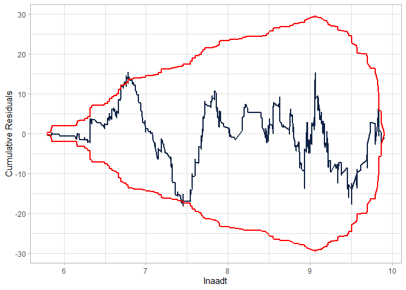
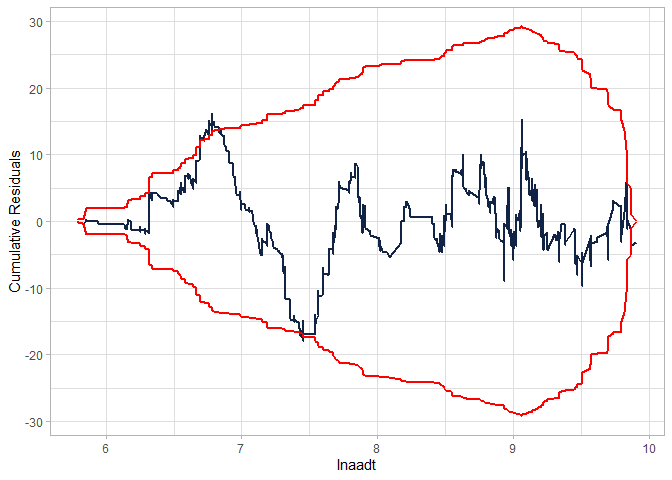
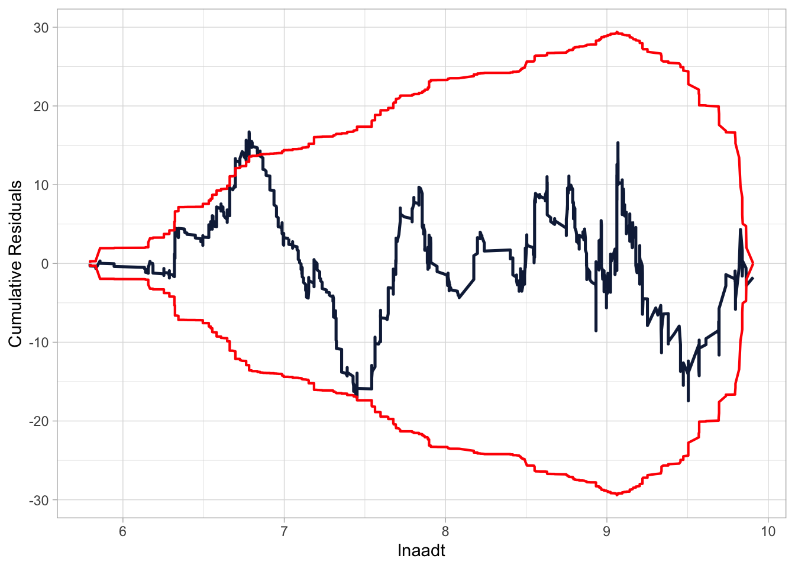

<!-- README.md is generated from README.Rmd. Please edit that file -->

# flexCountReg

<!-- badges: start -->

[](https://codecov.io/gh/jwood-iastate/flexCountReg)
<!-- badges: end -->

The goal of flexCountReg is to provide functions that allow the analyst
to estimate count regression models that can handle multiple analysis
issues including excess zeros, overdispersion as a function of variables
(i.e., generalized count models), random parameters, etc.

## Installation

You can install the development version of flexCountReg like using:

``` r
# install.packages("devtools")
devtools::install_github("jwood-iastate/flexCountReg")
```

## Functions and Data

The following functions are included in the `flexCountReg` package,
grouped by continuous and count distributions.

**Distribution Functions**

*Continuous Distributions*

- Inverse Gamma Distribution

  - `dinvgamma` for the density function
  - `pinvgamma` for the cumulative density function
  - `qinvgamma` for the quantile function
  - `rinvgamma` for random number generation

- Triangle Distribution

  - `dtri` for the density function
  - `ptri` for the cumulative density function
  - `qtri` for the quantile function
  - `rtri` for random number generation

- Lognormal Distribution

  - `mgf_lognormal` for estimating the moment generating function

*Count Distributions*

- Generalized Waring Distribution

  - `dgwar` for the density function
  - `pgwar` for the cumulative density function
  - `qgwar` for the quantile function
  - `rgwar` for random number generation

- Poisson-Generalized-Exponential Distribution

  - `dpge` for the density function
  - `ppge` for the cumulative density function
  - `qpge` for the quantile function
  - `rpge` for random number generation

- Poisson-Inverse-Gaussian Distribution

  - `dpinvgaus` for the density function
  - `ppinvgaus` for the cumulative density function
  - `qpinvgaus` for the quantile function
  - `rpinvgaus` for random number generation

- Poisson-Lindley Distribution

  - `dplind` for the density function
  - `pplind` for the cumulative density function
  - `qplind` for the quantile function
  - `rplind` for random number generation

- Poisson-Lindley-Gamma (Negative Binomial-Lindley) Distribution

  - `dplindGamma` for the density function
  - `pplindGamma` for the cumulative density function
  - `qplindGamma` for the quantile function
  - `rplindGamma` for random number generation

- Poisson-Lindley-Lognormal Distribution

  - `dplindLnorm` for the density function
  - `pplindLnorm` for the cumulative density function
  - `qplindLnorm` for the quantile function
  - `rplindLnorm` for random number generation

- Poisson-Lognormal Distribution

  - `dpLnorm` for the density function
  - `ppLnorm` for the cumulative density function
  - `qtpLnorm` for the quantile function
  - `rpLnorm` for random number generation

- Poisson-Weibull Distribution

  - `dpoisweibull` for the density function
  - `ppoisweibull` for the cumulative density function
  - `qpoisweibull` for the quantile function
  - `rpoisweibull` for random number generation

- Sichel Distribution

  - `dsichel` for the density function
  - `psichel` for the cumulative density function
  - `qsichel` for the quantile function
  - `rsichel` for random number generation

**Model Estimation Functions**

- `flexCountReg` is a general function for estimating any of the
  regression models
- `nbg` estimates negative binomial regression (NB-1, NB-2, or NB-P) and
  allows the overdispersion parameter to be specified as a function of
  predictors.
- `poisGE` estimates the Poisson-Generalized-Exponential regression
  model. It allows the scale parameter to be specified as a function of
  predictors.
- `poisInvGaus` estimates the Poisson-Inverse-Gaussian regression model.
- `poisLind` estimates the Poisson-Lindley regression model.
- `poisLindGamma` estimates the Poisson-Lindley-Gamma (i.e., Negative
  Binomial-Lindley) regression model.
- `poisLindLnorm` estimates the Poisson-Lindley-Lognormal regression
  model.
- `poisLogn` estimates the Poisson-Lognormal regression model. It allows
  the standard deviation parameter ($\sigma$) to be specified as a
  function of predictors.
- `pwiebreg` estimates the Poisson-Weibull regression model. It allows
  the shape and scale parameters to be specified as functions of
  predictors.
- `rpnb` estimates the random parameters negative binomial regression
  (NB-1, NB-2, or NB-P).
- `sichel` estimates the Sichel regression model. It allows the scale
  parameter to be specified as a function of predictors.

**Model Evaluation, Comparison, and Convenience Functions**

- `cureplot` generates a CURE plot for the specified model, based on the
  [cureplots package](https://gbasulto.github.io/cureplots/).
- `mae` computes the Mean Absolute Error (MAE).
- `myAIC` computes the Akaike Information Criterion (AIC) value.
- `myBIC` computes the Bayesian Information Criterion (BIC) value.
- `regCompTable` creates a publication-ready table comparing multiple
  models. This can include the regression estimate results, AIC, BIC,
  and Pseudo R-Square values.
- `regCompTest` compares any given model with a base model. This can be
  used to perform a likelihood ratio test between models.
- `rmse` computes the Root Mean Squared Error (RMSE).
- `predict` allows the predict function to be used for out-of-sample
  predictions for any of the flexCountReg models.
- `summary` allows the use of the summary function to get a model
  summary from a flexCountReg regression object.

**Data** A dataset, `washington_roads`, is included. It is based on a
sample of Washington primary 2-lane roads from the years 2016-2018. Data
for the roads, traffic volumes (AADT) and associated crashes were
obtained from the [Highway Safety Information System
(HSIS)](https://highways.dot.gov/research/safety/hsis).

### Probability Distributions

As noted in the list of functions, the probability distributions below
are included in the flexCountReg package. Details of the distributions
are provided in the documentation (help files).

**Continuous Distributions**

- Inverse Gamma Distribution
- Triangle Distribution

**Count Distributions**

- Generalized Waring Distribution
- Negative Binomial in various forms (NB-1, NB-2, and NB-P)
- Poisson-Generalized-Exponential Distribution
- Poisson-Inverse-Gaussian Distribution
- Poisson-Lindley Distribution
- Poisson-Lindley-Gamma (Negative Binomial-Lindley) Distribution
- Poisson-Lindley-Lognormal Distribution
- Poisson-Lognormal Distribution
- Poisson-Weibull Distribution
- Sichel Distribution

## Example

The following is an example of using flexCountReg to estimate a negative
binomial (NB-2) regression model with the overdispersion parameter as a
function of predictor variables:

``` r
library(gt) # used to format summary tables here
library(flexCountReg)
library(knitr)

data("washington_roads")
washington_roads$AADTover10k <- ifelse(washington_roads$AADT>10000,1,0)
gen.nb2 <- flexCountReg(Total_crashes ~ lnaadt + lnlength + speed50 +
                                ShouldWidth04 + AADTover10k,
                                ln.alpha.formula = ~ 1+lnlength,
                                data=washington_roads,
                                dist="NB2",
                                method = 'NM')
```

``` r
kable(summary(gen.nb2), caption = "NB-2 Model Summary")
#> Call:
#>  Total_crashes ~ lnaadt + lnlength + speed50 + ShouldWidth04 +      AADTover10k 
#> 
#>  Method:  Nelder-Mead maximization 
#> Iterations:  201 
#> Convergence:  iteration limit exceeded  
#> Log-likelihood:  -1073.026 
#> 
#> Parameter Estimates:
#> # A tibble: 8 × 7
#>   parameter           coeff `Std. Err.` `t-stat` `p-value` `lower CI` `upper CI`
#>   <chr>               <dbl>       <dbl>    <dbl>     <dbl>      <dbl>      <dbl>
#> 1 (Intercept)        -8.72        0.049 -178.        0         -8.81      -8.62 
#> 2 lnaadt              1.06        0.006  185.        0          1.05       1.07 
#> 3 lnlength            0.934       0.042   22.2       0          0.852      1.02 
#> 4 speed50            -0.427       0.101   -4.21      0         -0.625     -0.228
#> 5 ShouldWidth04       0.285       0.07     4.07      0          0.147      0.422
#> 6 AADTover10k         0.747       0.116    6.42      0          0.519      0.975
#> 7 ln(alpha):  (Inte…  0.581       0.172    3.37      0.001      0.243      0.919
#> 8 ln(alpha):  lnlen…  0.058       0.151    0.383     0.701     -0.239      0.355
```

| parameter              |  coeff | Std. Err. |   t-stat | p-value | lower CI | upper CI |
|:-----------------------|-------:|----------:|---------:|--------:|---------:|---------:|
| (Intercept)            | -8.716 |     0.049 | -177.505 |   0.000 |   -8.812 |   -8.620 |
| lnaadt                 |  1.063 |     0.006 |  185.240 |   0.000 |    1.052 |    1.074 |
| lnlength               |  0.934 |     0.042 |   22.248 |   0.000 |    0.852 |    1.017 |
| speed50                | -0.427 |     0.101 |   -4.209 |   0.000 |   -0.625 |   -0.228 |
| ShouldWidth04          |  0.285 |     0.070 |    4.066 |   0.000 |    0.147 |    0.422 |
| AADTover10k            |  0.747 |     0.116 |    6.417 |   0.000 |    0.519 |    0.975 |
| ln(alpha): (Intercept) |  0.581 |     0.172 |    3.371 |   0.001 |    0.243 |    0.919 |
| ln(alpha): lnlength    |  0.058 |     0.151 |    0.383 |   0.701 |   -0.239 |    0.355 |

NB-2 Model Summary

``` r
tesstats <- regCompTest(gen.nb2)
knitr::kable(tesstats$statistics)
```

| Statistic             |     Model | BaseModel |
|:----------------------|----------:|----------:|
| AIC                   | 2162.0527 |  3049.659 |
| BIC                   | 2204.5638 |  3054.973 |
| LR Test Statistic     |  901.6065 |        NA |
| LR degrees of freedom |    7.0000 |        NA |
| LR p-value            |    0.0000 |        NA |
| McFadden’s Pseudo R^2 |    0.2958 |        NA |

Checking the CURE plot:

``` r
cureplot(gen.nb2, indvar  ="lnaadt")
#> [1] 1501   14
#> Covariate: indvar_values
#> CURE data frame was provided. Its first column, lnaadt, will be used.
```



Modifying the model to fit better:

``` r
gen.nb2 <- flexCountReg(Total_crashes ~ lnaadt  + lnlength + speed50 +
                                ShouldWidth04 + AADTover10k + I(AADTover10k/lnaadt),
                                ln.alpha.formula = ~ 1+lnlength,
                                data=washington_roads,
                                dist="NB2",
                                method = 'NM')
gt(summary(gen.nb2), caption = "Modified NB-2 Model Summary")
#> Call:
#>  Total_crashes ~ lnaadt + lnlength + speed50 + ShouldWidth04 +      AADTover10k + I(AADTover10k/lnaadt) 
#> 
#>  Method:  Nelder-Mead maximization 
#> Iterations:  202 
#> Convergence:  iteration limit exceeded  
#> Log-likelihood:  -1062.504 
#> 
#> Parameter Estimates:
#> # A tibble: 9 × 7
#>   parameter           coeff `Std. Err.` `t-stat` `p-value` `lower CI` `upper CI`
#>   <chr>               <dbl>       <dbl>    <dbl>     <dbl>      <dbl>      <dbl>
#> 1 (Intercept)        -7.36        0.043 -173.        0         -7.45      -7.28 
#> 2 lnaadt              0.894       0.005  181.        0          0.884      0.904
#> 3 lnlength            0.862       0.037   23.4       0          0.79       0.935
#> 4 speed50            -0.409       0.092   -4.46      0         -0.588     -0.229
#> 5 ShouldWidth04       0.251       0.059    4.23      0          0.134      0.367
#> 6 AADTover10k         5.09        0.09    56.8       0          4.91       5.26 
#> 7 I(AADTover10k/ln… -41.2         0.938  -43.9       0        -43.0      -39.3  
#> 8 ln(alpha):  (Int…   1.56        0.34     4.58      0          0.892      2.22 
#> 9 ln(alpha):  lnle…   0.022       0.35     0.064     0.949     -0.663      0.708
```

<div id="zxozebpgry" style="padding-left:0px;padding-right:0px;padding-top:10px;padding-bottom:10px;overflow-x:auto;overflow-y:auto;width:auto;height:auto;">
<style>#zxozebpgry table {
  font-family: system-ui, 'Segoe UI', Roboto, Helvetica, Arial, sans-serif, 'Apple Color Emoji', 'Segoe UI Emoji', 'Segoe UI Symbol', 'Noto Color Emoji';
  -webkit-font-smoothing: antialiased;
  -moz-osx-font-smoothing: grayscale;
}
&#10;#zxozebpgry thead, #zxozebpgry tbody, #zxozebpgry tfoot, #zxozebpgry tr, #zxozebpgry td, #zxozebpgry th {
  border-style: none;
}
&#10;#zxozebpgry p {
  margin: 0;
  padding: 0;
}
&#10;#zxozebpgry .gt_table {
  display: table;
  border-collapse: collapse;
  line-height: normal;
  margin-left: auto;
  margin-right: auto;
  color: #333333;
  font-size: 16px;
  font-weight: normal;
  font-style: normal;
  background-color: #FFFFFF;
  width: auto;
  border-top-style: solid;
  border-top-width: 2px;
  border-top-color: #A8A8A8;
  border-right-style: none;
  border-right-width: 2px;
  border-right-color: #D3D3D3;
  border-bottom-style: solid;
  border-bottom-width: 2px;
  border-bottom-color: #A8A8A8;
  border-left-style: none;
  border-left-width: 2px;
  border-left-color: #D3D3D3;
}
&#10;#zxozebpgry .gt_caption {
  padding-top: 4px;
  padding-bottom: 4px;
}
&#10;#zxozebpgry .gt_title {
  color: #333333;
  font-size: 125%;
  font-weight: initial;
  padding-top: 4px;
  padding-bottom: 4px;
  padding-left: 5px;
  padding-right: 5px;
  border-bottom-color: #FFFFFF;
  border-bottom-width: 0;
}
&#10;#zxozebpgry .gt_subtitle {
  color: #333333;
  font-size: 85%;
  font-weight: initial;
  padding-top: 3px;
  padding-bottom: 5px;
  padding-left: 5px;
  padding-right: 5px;
  border-top-color: #FFFFFF;
  border-top-width: 0;
}
&#10;#zxozebpgry .gt_heading {
  background-color: #FFFFFF;
  text-align: center;
  border-bottom-color: #FFFFFF;
  border-left-style: none;
  border-left-width: 1px;
  border-left-color: #D3D3D3;
  border-right-style: none;
  border-right-width: 1px;
  border-right-color: #D3D3D3;
}
&#10;#zxozebpgry .gt_bottom_border {
  border-bottom-style: solid;
  border-bottom-width: 2px;
  border-bottom-color: #D3D3D3;
}
&#10;#zxozebpgry .gt_col_headings {
  border-top-style: solid;
  border-top-width: 2px;
  border-top-color: #D3D3D3;
  border-bottom-style: solid;
  border-bottom-width: 2px;
  border-bottom-color: #D3D3D3;
  border-left-style: none;
  border-left-width: 1px;
  border-left-color: #D3D3D3;
  border-right-style: none;
  border-right-width: 1px;
  border-right-color: #D3D3D3;
}
&#10;#zxozebpgry .gt_col_heading {
  color: #333333;
  background-color: #FFFFFF;
  font-size: 100%;
  font-weight: normal;
  text-transform: inherit;
  border-left-style: none;
  border-left-width: 1px;
  border-left-color: #D3D3D3;
  border-right-style: none;
  border-right-width: 1px;
  border-right-color: #D3D3D3;
  vertical-align: bottom;
  padding-top: 5px;
  padding-bottom: 6px;
  padding-left: 5px;
  padding-right: 5px;
  overflow-x: hidden;
}
&#10;#zxozebpgry .gt_column_spanner_outer {
  color: #333333;
  background-color: #FFFFFF;
  font-size: 100%;
  font-weight: normal;
  text-transform: inherit;
  padding-top: 0;
  padding-bottom: 0;
  padding-left: 4px;
  padding-right: 4px;
}
&#10;#zxozebpgry .gt_column_spanner_outer:first-child {
  padding-left: 0;
}
&#10;#zxozebpgry .gt_column_spanner_outer:last-child {
  padding-right: 0;
}
&#10;#zxozebpgry .gt_column_spanner {
  border-bottom-style: solid;
  border-bottom-width: 2px;
  border-bottom-color: #D3D3D3;
  vertical-align: bottom;
  padding-top: 5px;
  padding-bottom: 5px;
  overflow-x: hidden;
  display: inline-block;
  width: 100%;
}
&#10;#zxozebpgry .gt_spanner_row {
  border-bottom-style: hidden;
}
&#10;#zxozebpgry .gt_group_heading {
  padding-top: 8px;
  padding-bottom: 8px;
  padding-left: 5px;
  padding-right: 5px;
  color: #333333;
  background-color: #FFFFFF;
  font-size: 100%;
  font-weight: initial;
  text-transform: inherit;
  border-top-style: solid;
  border-top-width: 2px;
  border-top-color: #D3D3D3;
  border-bottom-style: solid;
  border-bottom-width: 2px;
  border-bottom-color: #D3D3D3;
  border-left-style: none;
  border-left-width: 1px;
  border-left-color: #D3D3D3;
  border-right-style: none;
  border-right-width: 1px;
  border-right-color: #D3D3D3;
  vertical-align: middle;
  text-align: left;
}
&#10;#zxozebpgry .gt_empty_group_heading {
  padding: 0.5px;
  color: #333333;
  background-color: #FFFFFF;
  font-size: 100%;
  font-weight: initial;
  border-top-style: solid;
  border-top-width: 2px;
  border-top-color: #D3D3D3;
  border-bottom-style: solid;
  border-bottom-width: 2px;
  border-bottom-color: #D3D3D3;
  vertical-align: middle;
}
&#10;#zxozebpgry .gt_from_md > :first-child {
  margin-top: 0;
}
&#10;#zxozebpgry .gt_from_md > :last-child {
  margin-bottom: 0;
}
&#10;#zxozebpgry .gt_row {
  padding-top: 8px;
  padding-bottom: 8px;
  padding-left: 5px;
  padding-right: 5px;
  margin: 10px;
  border-top-style: solid;
  border-top-width: 1px;
  border-top-color: #D3D3D3;
  border-left-style: none;
  border-left-width: 1px;
  border-left-color: #D3D3D3;
  border-right-style: none;
  border-right-width: 1px;
  border-right-color: #D3D3D3;
  vertical-align: middle;
  overflow-x: hidden;
}
&#10;#zxozebpgry .gt_stub {
  color: #333333;
  background-color: #FFFFFF;
  font-size: 100%;
  font-weight: initial;
  text-transform: inherit;
  border-right-style: solid;
  border-right-width: 2px;
  border-right-color: #D3D3D3;
  padding-left: 5px;
  padding-right: 5px;
}
&#10;#zxozebpgry .gt_stub_row_group {
  color: #333333;
  background-color: #FFFFFF;
  font-size: 100%;
  font-weight: initial;
  text-transform: inherit;
  border-right-style: solid;
  border-right-width: 2px;
  border-right-color: #D3D3D3;
  padding-left: 5px;
  padding-right: 5px;
  vertical-align: top;
}
&#10;#zxozebpgry .gt_row_group_first td {
  border-top-width: 2px;
}
&#10;#zxozebpgry .gt_row_group_first th {
  border-top-width: 2px;
}
&#10;#zxozebpgry .gt_summary_row {
  color: #333333;
  background-color: #FFFFFF;
  text-transform: inherit;
  padding-top: 8px;
  padding-bottom: 8px;
  padding-left: 5px;
  padding-right: 5px;
}
&#10;#zxozebpgry .gt_first_summary_row {
  border-top-style: solid;
  border-top-color: #D3D3D3;
}
&#10;#zxozebpgry .gt_first_summary_row.thick {
  border-top-width: 2px;
}
&#10;#zxozebpgry .gt_last_summary_row {
  padding-top: 8px;
  padding-bottom: 8px;
  padding-left: 5px;
  padding-right: 5px;
  border-bottom-style: solid;
  border-bottom-width: 2px;
  border-bottom-color: #D3D3D3;
}
&#10;#zxozebpgry .gt_grand_summary_row {
  color: #333333;
  background-color: #FFFFFF;
  text-transform: inherit;
  padding-top: 8px;
  padding-bottom: 8px;
  padding-left: 5px;
  padding-right: 5px;
}
&#10;#zxozebpgry .gt_first_grand_summary_row {
  padding-top: 8px;
  padding-bottom: 8px;
  padding-left: 5px;
  padding-right: 5px;
  border-top-style: double;
  border-top-width: 6px;
  border-top-color: #D3D3D3;
}
&#10;#zxozebpgry .gt_last_grand_summary_row_top {
  padding-top: 8px;
  padding-bottom: 8px;
  padding-left: 5px;
  padding-right: 5px;
  border-bottom-style: double;
  border-bottom-width: 6px;
  border-bottom-color: #D3D3D3;
}
&#10;#zxozebpgry .gt_striped {
  background-color: rgba(128, 128, 128, 0.05);
}
&#10;#zxozebpgry .gt_table_body {
  border-top-style: solid;
  border-top-width: 2px;
  border-top-color: #D3D3D3;
  border-bottom-style: solid;
  border-bottom-width: 2px;
  border-bottom-color: #D3D3D3;
}
&#10;#zxozebpgry .gt_footnotes {
  color: #333333;
  background-color: #FFFFFF;
  border-bottom-style: none;
  border-bottom-width: 2px;
  border-bottom-color: #D3D3D3;
  border-left-style: none;
  border-left-width: 2px;
  border-left-color: #D3D3D3;
  border-right-style: none;
  border-right-width: 2px;
  border-right-color: #D3D3D3;
}
&#10;#zxozebpgry .gt_footnote {
  margin: 0px;
  font-size: 90%;
  padding-top: 4px;
  padding-bottom: 4px;
  padding-left: 5px;
  padding-right: 5px;
}
&#10;#zxozebpgry .gt_sourcenotes {
  color: #333333;
  background-color: #FFFFFF;
  border-bottom-style: none;
  border-bottom-width: 2px;
  border-bottom-color: #D3D3D3;
  border-left-style: none;
  border-left-width: 2px;
  border-left-color: #D3D3D3;
  border-right-style: none;
  border-right-width: 2px;
  border-right-color: #D3D3D3;
}
&#10;#zxozebpgry .gt_sourcenote {
  font-size: 90%;
  padding-top: 4px;
  padding-bottom: 4px;
  padding-left: 5px;
  padding-right: 5px;
}
&#10;#zxozebpgry .gt_left {
  text-align: left;
}
&#10;#zxozebpgry .gt_center {
  text-align: center;
}
&#10;#zxozebpgry .gt_right {
  text-align: right;
  font-variant-numeric: tabular-nums;
}
&#10;#zxozebpgry .gt_font_normal {
  font-weight: normal;
}
&#10;#zxozebpgry .gt_font_bold {
  font-weight: bold;
}
&#10;#zxozebpgry .gt_font_italic {
  font-style: italic;
}
&#10;#zxozebpgry .gt_super {
  font-size: 65%;
}
&#10;#zxozebpgry .gt_footnote_marks {
  font-size: 75%;
  vertical-align: 0.4em;
  position: initial;
}
&#10;#zxozebpgry .gt_asterisk {
  font-size: 100%;
  vertical-align: 0;
}
&#10;#zxozebpgry .gt_indent_1 {
  text-indent: 5px;
}
&#10;#zxozebpgry .gt_indent_2 {
  text-indent: 10px;
}
&#10;#zxozebpgry .gt_indent_3 {
  text-indent: 15px;
}
&#10;#zxozebpgry .gt_indent_4 {
  text-indent: 20px;
}
&#10;#zxozebpgry .gt_indent_5 {
  text-indent: 25px;
}
&#10;#zxozebpgry .katex-display {
  display: inline-flex !important;
  margin-bottom: 0.75em !important;
}
&#10;#zxozebpgry div.Reactable > div.rt-table > div.rt-thead > div.rt-tr.rt-tr-group-header > div.rt-th-group:after {
  height: 0px !important;
}
</style>
<table class="gt_table" data-quarto-disable-processing="false" data-quarto-bootstrap="false">
  <caption>Modified NB-2 Model Summary</caption>
  <thead>
    <tr class="gt_col_headings">
      <th class="gt_col_heading gt_columns_bottom_border gt_left" rowspan="1" colspan="1" scope="col" id="parameter">parameter</th>
      <th class="gt_col_heading gt_columns_bottom_border gt_right" rowspan="1" colspan="1" scope="col" id="coeff">coeff</th>
      <th class="gt_col_heading gt_columns_bottom_border gt_right" rowspan="1" colspan="1" scope="col" id="Std. Err.">Std. Err.</th>
      <th class="gt_col_heading gt_columns_bottom_border gt_right" rowspan="1" colspan="1" scope="col" id="t-stat">t-stat</th>
      <th class="gt_col_heading gt_columns_bottom_border gt_right" rowspan="1" colspan="1" scope="col" id="p-value">p-value</th>
      <th class="gt_col_heading gt_columns_bottom_border gt_right" rowspan="1" colspan="1" scope="col" id="lower CI">lower CI</th>
      <th class="gt_col_heading gt_columns_bottom_border gt_right" rowspan="1" colspan="1" scope="col" id="upper CI">upper CI</th>
    </tr>
  </thead>
  <tbody class="gt_table_body">
    <tr><td headers="parameter" class="gt_row gt_left">(Intercept)</td>
<td headers="coeff" class="gt_row gt_right">-7.364</td>
<td headers="Std. Err." class="gt_row gt_right">0.043</td>
<td headers="t-stat" class="gt_row gt_right">-173.167</td>
<td headers="p-value" class="gt_row gt_right">0.000</td>
<td headers="lower CI" class="gt_row gt_right">-7.447</td>
<td headers="upper CI" class="gt_row gt_right">-7.281</td></tr>
    <tr><td headers="parameter" class="gt_row gt_left">lnaadt</td>
<td headers="coeff" class="gt_row gt_right">0.894</td>
<td headers="Std. Err." class="gt_row gt_right">0.005</td>
<td headers="t-stat" class="gt_row gt_right">181.134</td>
<td headers="p-value" class="gt_row gt_right">0.000</td>
<td headers="lower CI" class="gt_row gt_right">0.884</td>
<td headers="upper CI" class="gt_row gt_right">0.904</td></tr>
    <tr><td headers="parameter" class="gt_row gt_left">lnlength</td>
<td headers="coeff" class="gt_row gt_right">0.862</td>
<td headers="Std. Err." class="gt_row gt_right">0.037</td>
<td headers="t-stat" class="gt_row gt_right">23.373</td>
<td headers="p-value" class="gt_row gt_right">0.000</td>
<td headers="lower CI" class="gt_row gt_right">0.790</td>
<td headers="upper CI" class="gt_row gt_right">0.935</td></tr>
    <tr><td headers="parameter" class="gt_row gt_left">speed50</td>
<td headers="coeff" class="gt_row gt_right">-0.409</td>
<td headers="Std. Err." class="gt_row gt_right">0.092</td>
<td headers="t-stat" class="gt_row gt_right">-4.462</td>
<td headers="p-value" class="gt_row gt_right">0.000</td>
<td headers="lower CI" class="gt_row gt_right">-0.588</td>
<td headers="upper CI" class="gt_row gt_right">-0.229</td></tr>
    <tr><td headers="parameter" class="gt_row gt_left">ShouldWidth04</td>
<td headers="coeff" class="gt_row gt_right">0.251</td>
<td headers="Std. Err." class="gt_row gt_right">0.059</td>
<td headers="t-stat" class="gt_row gt_right">4.226</td>
<td headers="p-value" class="gt_row gt_right">0.000</td>
<td headers="lower CI" class="gt_row gt_right">0.134</td>
<td headers="upper CI" class="gt_row gt_right">0.367</td></tr>
    <tr><td headers="parameter" class="gt_row gt_left">AADTover10k</td>
<td headers="coeff" class="gt_row gt_right">5.086</td>
<td headers="Std. Err." class="gt_row gt_right">0.090</td>
<td headers="t-stat" class="gt_row gt_right">56.822</td>
<td headers="p-value" class="gt_row gt_right">0.000</td>
<td headers="lower CI" class="gt_row gt_right">4.910</td>
<td headers="upper CI" class="gt_row gt_right">5.261</td></tr>
    <tr><td headers="parameter" class="gt_row gt_left">I(AADTover10k/lnaadt)</td>
<td headers="coeff" class="gt_row gt_right">-41.179</td>
<td headers="Std. Err." class="gt_row gt_right">0.938</td>
<td headers="t-stat" class="gt_row gt_right">-43.907</td>
<td headers="p-value" class="gt_row gt_right">0.000</td>
<td headers="lower CI" class="gt_row gt_right">-43.017</td>
<td headers="upper CI" class="gt_row gt_right">-39.341</td></tr>
    <tr><td headers="parameter" class="gt_row gt_left">ln(alpha):  (Intercept)</td>
<td headers="coeff" class="gt_row gt_right">1.558</td>
<td headers="Std. Err." class="gt_row gt_right">0.340</td>
<td headers="t-stat" class="gt_row gt_right">4.581</td>
<td headers="p-value" class="gt_row gt_right">0.000</td>
<td headers="lower CI" class="gt_row gt_right">0.892</td>
<td headers="upper CI" class="gt_row gt_right">2.225</td></tr>
    <tr><td headers="parameter" class="gt_row gt_left">ln(alpha):  lnlength</td>
<td headers="coeff" class="gt_row gt_right">0.022</td>
<td headers="Std. Err." class="gt_row gt_right">0.350</td>
<td headers="t-stat" class="gt_row gt_right">0.064</td>
<td headers="p-value" class="gt_row gt_right">0.949</td>
<td headers="lower CI" class="gt_row gt_right">-0.663</td>
<td headers="upper CI" class="gt_row gt_right">0.708</td></tr>
  </tbody>
  &#10;  
</table>
</div>

``` r

tesstats <- regCompTest(gen.nb2)
tesstats$gtTable
```

<div id="cxrtgbtwpq" style="padding-left:0px;padding-right:0px;padding-top:10px;padding-bottom:10px;overflow-x:auto;overflow-y:auto;width:auto;height:auto;">
<style>#cxrtgbtwpq table {
  font-family: system-ui, 'Segoe UI', Roboto, Helvetica, Arial, sans-serif, 'Apple Color Emoji', 'Segoe UI Emoji', 'Segoe UI Symbol', 'Noto Color Emoji';
  -webkit-font-smoothing: antialiased;
  -moz-osx-font-smoothing: grayscale;
}
&#10;#cxrtgbtwpq thead, #cxrtgbtwpq tbody, #cxrtgbtwpq tfoot, #cxrtgbtwpq tr, #cxrtgbtwpq td, #cxrtgbtwpq th {
  border-style: none;
}
&#10;#cxrtgbtwpq p {
  margin: 0;
  padding: 0;
}
&#10;#cxrtgbtwpq .gt_table {
  display: table;
  border-collapse: collapse;
  line-height: normal;
  margin-left: auto;
  margin-right: auto;
  color: #333333;
  font-size: 16px;
  font-weight: normal;
  font-style: normal;
  background-color: #FFFFFF;
  width: auto;
  border-top-style: solid;
  border-top-width: 2px;
  border-top-color: #A8A8A8;
  border-right-style: none;
  border-right-width: 2px;
  border-right-color: #D3D3D3;
  border-bottom-style: solid;
  border-bottom-width: 2px;
  border-bottom-color: #A8A8A8;
  border-left-style: none;
  border-left-width: 2px;
  border-left-color: #D3D3D3;
}
&#10;#cxrtgbtwpq .gt_caption {
  padding-top: 4px;
  padding-bottom: 4px;
}
&#10;#cxrtgbtwpq .gt_title {
  color: #333333;
  font-size: 125%;
  font-weight: initial;
  padding-top: 4px;
  padding-bottom: 4px;
  padding-left: 5px;
  padding-right: 5px;
  border-bottom-color: #FFFFFF;
  border-bottom-width: 0;
}
&#10;#cxrtgbtwpq .gt_subtitle {
  color: #333333;
  font-size: 85%;
  font-weight: initial;
  padding-top: 3px;
  padding-bottom: 5px;
  padding-left: 5px;
  padding-right: 5px;
  border-top-color: #FFFFFF;
  border-top-width: 0;
}
&#10;#cxrtgbtwpq .gt_heading {
  background-color: #FFFFFF;
  text-align: center;
  border-bottom-color: #FFFFFF;
  border-left-style: none;
  border-left-width: 1px;
  border-left-color: #D3D3D3;
  border-right-style: none;
  border-right-width: 1px;
  border-right-color: #D3D3D3;
}
&#10;#cxrtgbtwpq .gt_bottom_border {
  border-bottom-style: solid;
  border-bottom-width: 2px;
  border-bottom-color: #D3D3D3;
}
&#10;#cxrtgbtwpq .gt_col_headings {
  border-top-style: solid;
  border-top-width: 2px;
  border-top-color: #D3D3D3;
  border-bottom-style: solid;
  border-bottom-width: 2px;
  border-bottom-color: #D3D3D3;
  border-left-style: none;
  border-left-width: 1px;
  border-left-color: #D3D3D3;
  border-right-style: none;
  border-right-width: 1px;
  border-right-color: #D3D3D3;
}
&#10;#cxrtgbtwpq .gt_col_heading {
  color: #333333;
  background-color: #FFFFFF;
  font-size: 100%;
  font-weight: normal;
  text-transform: inherit;
  border-left-style: none;
  border-left-width: 1px;
  border-left-color: #D3D3D3;
  border-right-style: none;
  border-right-width: 1px;
  border-right-color: #D3D3D3;
  vertical-align: bottom;
  padding-top: 5px;
  padding-bottom: 6px;
  padding-left: 5px;
  padding-right: 5px;
  overflow-x: hidden;
}
&#10;#cxrtgbtwpq .gt_column_spanner_outer {
  color: #333333;
  background-color: #FFFFFF;
  font-size: 100%;
  font-weight: normal;
  text-transform: inherit;
  padding-top: 0;
  padding-bottom: 0;
  padding-left: 4px;
  padding-right: 4px;
}
&#10;#cxrtgbtwpq .gt_column_spanner_outer:first-child {
  padding-left: 0;
}
&#10;#cxrtgbtwpq .gt_column_spanner_outer:last-child {
  padding-right: 0;
}
&#10;#cxrtgbtwpq .gt_column_spanner {
  border-bottom-style: solid;
  border-bottom-width: 2px;
  border-bottom-color: #D3D3D3;
  vertical-align: bottom;
  padding-top: 5px;
  padding-bottom: 5px;
  overflow-x: hidden;
  display: inline-block;
  width: 100%;
}
&#10;#cxrtgbtwpq .gt_spanner_row {
  border-bottom-style: hidden;
}
&#10;#cxrtgbtwpq .gt_group_heading {
  padding-top: 8px;
  padding-bottom: 8px;
  padding-left: 5px;
  padding-right: 5px;
  color: #333333;
  background-color: #FFFFFF;
  font-size: 100%;
  font-weight: initial;
  text-transform: inherit;
  border-top-style: solid;
  border-top-width: 2px;
  border-top-color: #D3D3D3;
  border-bottom-style: solid;
  border-bottom-width: 2px;
  border-bottom-color: #D3D3D3;
  border-left-style: none;
  border-left-width: 1px;
  border-left-color: #D3D3D3;
  border-right-style: none;
  border-right-width: 1px;
  border-right-color: #D3D3D3;
  vertical-align: middle;
  text-align: left;
}
&#10;#cxrtgbtwpq .gt_empty_group_heading {
  padding: 0.5px;
  color: #333333;
  background-color: #FFFFFF;
  font-size: 100%;
  font-weight: initial;
  border-top-style: solid;
  border-top-width: 2px;
  border-top-color: #D3D3D3;
  border-bottom-style: solid;
  border-bottom-width: 2px;
  border-bottom-color: #D3D3D3;
  vertical-align: middle;
}
&#10;#cxrtgbtwpq .gt_from_md > :first-child {
  margin-top: 0;
}
&#10;#cxrtgbtwpq .gt_from_md > :last-child {
  margin-bottom: 0;
}
&#10;#cxrtgbtwpq .gt_row {
  padding-top: 8px;
  padding-bottom: 8px;
  padding-left: 5px;
  padding-right: 5px;
  margin: 10px;
  border-top-style: solid;
  border-top-width: 1px;
  border-top-color: #D3D3D3;
  border-left-style: none;
  border-left-width: 1px;
  border-left-color: #D3D3D3;
  border-right-style: none;
  border-right-width: 1px;
  border-right-color: #D3D3D3;
  vertical-align: middle;
  overflow-x: hidden;
}
&#10;#cxrtgbtwpq .gt_stub {
  color: #333333;
  background-color: #FFFFFF;
  font-size: 100%;
  font-weight: initial;
  text-transform: inherit;
  border-right-style: solid;
  border-right-width: 2px;
  border-right-color: #D3D3D3;
  padding-left: 5px;
  padding-right: 5px;
}
&#10;#cxrtgbtwpq .gt_stub_row_group {
  color: #333333;
  background-color: #FFFFFF;
  font-size: 100%;
  font-weight: initial;
  text-transform: inherit;
  border-right-style: solid;
  border-right-width: 2px;
  border-right-color: #D3D3D3;
  padding-left: 5px;
  padding-right: 5px;
  vertical-align: top;
}
&#10;#cxrtgbtwpq .gt_row_group_first td {
  border-top-width: 2px;
}
&#10;#cxrtgbtwpq .gt_row_group_first th {
  border-top-width: 2px;
}
&#10;#cxrtgbtwpq .gt_summary_row {
  color: #333333;
  background-color: #FFFFFF;
  text-transform: inherit;
  padding-top: 8px;
  padding-bottom: 8px;
  padding-left: 5px;
  padding-right: 5px;
}
&#10;#cxrtgbtwpq .gt_first_summary_row {
  border-top-style: solid;
  border-top-color: #D3D3D3;
}
&#10;#cxrtgbtwpq .gt_first_summary_row.thick {
  border-top-width: 2px;
}
&#10;#cxrtgbtwpq .gt_last_summary_row {
  padding-top: 8px;
  padding-bottom: 8px;
  padding-left: 5px;
  padding-right: 5px;
  border-bottom-style: solid;
  border-bottom-width: 2px;
  border-bottom-color: #D3D3D3;
}
&#10;#cxrtgbtwpq .gt_grand_summary_row {
  color: #333333;
  background-color: #FFFFFF;
  text-transform: inherit;
  padding-top: 8px;
  padding-bottom: 8px;
  padding-left: 5px;
  padding-right: 5px;
}
&#10;#cxrtgbtwpq .gt_first_grand_summary_row {
  padding-top: 8px;
  padding-bottom: 8px;
  padding-left: 5px;
  padding-right: 5px;
  border-top-style: double;
  border-top-width: 6px;
  border-top-color: #D3D3D3;
}
&#10;#cxrtgbtwpq .gt_last_grand_summary_row_top {
  padding-top: 8px;
  padding-bottom: 8px;
  padding-left: 5px;
  padding-right: 5px;
  border-bottom-style: double;
  border-bottom-width: 6px;
  border-bottom-color: #D3D3D3;
}
&#10;#cxrtgbtwpq .gt_striped {
  background-color: rgba(128, 128, 128, 0.05);
}
&#10;#cxrtgbtwpq .gt_table_body {
  border-top-style: solid;
  border-top-width: 2px;
  border-top-color: #D3D3D3;
  border-bottom-style: solid;
  border-bottom-width: 2px;
  border-bottom-color: #D3D3D3;
}
&#10;#cxrtgbtwpq .gt_footnotes {
  color: #333333;
  background-color: #FFFFFF;
  border-bottom-style: none;
  border-bottom-width: 2px;
  border-bottom-color: #D3D3D3;
  border-left-style: none;
  border-left-width: 2px;
  border-left-color: #D3D3D3;
  border-right-style: none;
  border-right-width: 2px;
  border-right-color: #D3D3D3;
}
&#10;#cxrtgbtwpq .gt_footnote {
  margin: 0px;
  font-size: 90%;
  padding-top: 4px;
  padding-bottom: 4px;
  padding-left: 5px;
  padding-right: 5px;
}
&#10;#cxrtgbtwpq .gt_sourcenotes {
  color: #333333;
  background-color: #FFFFFF;
  border-bottom-style: none;
  border-bottom-width: 2px;
  border-bottom-color: #D3D3D3;
  border-left-style: none;
  border-left-width: 2px;
  border-left-color: #D3D3D3;
  border-right-style: none;
  border-right-width: 2px;
  border-right-color: #D3D3D3;
}
&#10;#cxrtgbtwpq .gt_sourcenote {
  font-size: 90%;
  padding-top: 4px;
  padding-bottom: 4px;
  padding-left: 5px;
  padding-right: 5px;
}
&#10;#cxrtgbtwpq .gt_left {
  text-align: left;
}
&#10;#cxrtgbtwpq .gt_center {
  text-align: center;
}
&#10;#cxrtgbtwpq .gt_right {
  text-align: right;
  font-variant-numeric: tabular-nums;
}
&#10;#cxrtgbtwpq .gt_font_normal {
  font-weight: normal;
}
&#10;#cxrtgbtwpq .gt_font_bold {
  font-weight: bold;
}
&#10;#cxrtgbtwpq .gt_font_italic {
  font-style: italic;
}
&#10;#cxrtgbtwpq .gt_super {
  font-size: 65%;
}
&#10;#cxrtgbtwpq .gt_footnote_marks {
  font-size: 75%;
  vertical-align: 0.4em;
  position: initial;
}
&#10;#cxrtgbtwpq .gt_asterisk {
  font-size: 100%;
  vertical-align: 0;
}
&#10;#cxrtgbtwpq .gt_indent_1 {
  text-indent: 5px;
}
&#10;#cxrtgbtwpq .gt_indent_2 {
  text-indent: 10px;
}
&#10;#cxrtgbtwpq .gt_indent_3 {
  text-indent: 15px;
}
&#10;#cxrtgbtwpq .gt_indent_4 {
  text-indent: 20px;
}
&#10;#cxrtgbtwpq .gt_indent_5 {
  text-indent: 25px;
}
&#10;#cxrtgbtwpq .katex-display {
  display: inline-flex !important;
  margin-bottom: 0.75em !important;
}
&#10;#cxrtgbtwpq div.Reactable > div.rt-table > div.rt-thead > div.rt-tr.rt-tr-group-header > div.rt-th-group:after {
  height: 0px !important;
}
</style>
<table class="gt_table" data-quarto-disable-processing="false" data-quarto-bootstrap="false">
  <thead>
    <tr class="gt_heading">
      <td colspan="3" class="gt_heading gt_title gt_font_normal gt_bottom_border" style>Model Comparison Statistics</td>
    </tr>
    &#10;    <tr class="gt_col_headings">
      <th class="gt_col_heading gt_columns_bottom_border gt_left" rowspan="1" colspan="1" scope="col" id="Statistic">Statistic</th>
      <th class="gt_col_heading gt_columns_bottom_border gt_right" rowspan="1" colspan="1" scope="col" id="Model">Model</th>
      <th class="gt_col_heading gt_columns_bottom_border gt_right" rowspan="1" colspan="1" scope="col" id="BaseModel">BaseModel</th>
    </tr>
  </thead>
  <tbody class="gt_table_body">
    <tr><td headers="Statistic" class="gt_row gt_left">AIC</td>
<td headers="Model" class="gt_row gt_right">2,143.0082</td>
<td headers="BaseModel" class="gt_row gt_right">3,049.6592</td></tr>
    <tr><td headers="Statistic" class="gt_row gt_left">BIC</td>
<td headers="Model" class="gt_row gt_right">2,190.8331</td>
<td headers="BaseModel" class="gt_row gt_right">3,054.9731</td></tr>
    <tr><td headers="Statistic" class="gt_row gt_left">LR Test Statistic</td>
<td headers="Model" class="gt_row gt_right">922.6510</td>
<td headers="BaseModel" class="gt_row gt_right">NA</td></tr>
    <tr><td headers="Statistic" class="gt_row gt_left">LR degrees of freedom</td>
<td headers="Model" class="gt_row gt_right">8.0000</td>
<td headers="BaseModel" class="gt_row gt_right">NA</td></tr>
    <tr><td headers="Statistic" class="gt_row gt_left">LR p-value</td>
<td headers="Model" class="gt_row gt_right">0.0000</td>
<td headers="BaseModel" class="gt_row gt_right">NA</td></tr>
    <tr><td headers="Statistic" class="gt_row gt_left">McFadden's Pseudo R^2</td>
<td headers="Model" class="gt_row gt_right">0.3027</td>
<td headers="BaseModel" class="gt_row gt_right">NA</td></tr>
  </tbody>
  &#10;  
</table>
</div>

``` r
cureplot(gen.nb2, indvar  ="lnaadt")
#> [1] 1501   14
#> Covariate: indvar_values
#> CURE data frame was provided. Its first column, lnaadt, will be used.
```



Estimating another model (NB-P) - without the interaction:

``` r
gen.nbp <- flexCountReg(Total_crashes ~ lnaadt + lnlength + speed50 +
                                ShouldWidth04 + AADTover10k,
                                ln.alpha.formula = ~ 1+lnlength,
                                data=washington_roads,
                                dist="NBP",
                                method = 'NM')
gt(summary(gen.nbp), caption = "NB-P Model Summary")
#> Call:
#>  Total_crashes ~ lnaadt + lnlength + speed50 + ShouldWidth04 +      AADTover10k 
#> 
#>  Method:  Nelder-Mead maximization 
#> Iterations:  202 
#> Convergence:  iteration limit exceeded  
#> Log-likelihood:  -1062.206 
#> 
#> Parameter Estimates:
#> # A tibble: 9 × 7
#>   parameter           coeff `Std. Err.` `t-stat` `p-value` `lower CI` `upper CI`
#>   <chr>               <dbl>       <dbl>    <dbl>     <dbl>      <dbl>      <dbl>
#> 1 (Intercept)        -7.73        0.043 -180.        0         -7.81      -7.64 
#> 2 lnaadt              0.935       0.005  189.        0          0.925      0.944
#> 3 lnlength            0.839       0.037   22.5       0          0.766      0.913
#> 4 speed50            -0.39        0.093   -4.18      0         -0.573     -0.207
#> 5 ShouldWidth04       0.255       0.059    4.29      0          0.139      0.372
#> 6 AADTover10k         0.693       0.088    7.92      0          0.522      0.865
#> 7 ln(alpha):  (Inte… -1.45        0.297   -4.88      0         -2.03      -0.865
#> 8 ln(alpha):  lnlen… -0.116       0.256   -0.455     0.649     -0.619      0.386
#> 9 P                   1.69        0.291    5.80      0          1.12       2.26
```

<div id="lfsylafasy" style="padding-left:0px;padding-right:0px;padding-top:10px;padding-bottom:10px;overflow-x:auto;overflow-y:auto;width:auto;height:auto;">
<style>#lfsylafasy table {
  font-family: system-ui, 'Segoe UI', Roboto, Helvetica, Arial, sans-serif, 'Apple Color Emoji', 'Segoe UI Emoji', 'Segoe UI Symbol', 'Noto Color Emoji';
  -webkit-font-smoothing: antialiased;
  -moz-osx-font-smoothing: grayscale;
}
&#10;#lfsylafasy thead, #lfsylafasy tbody, #lfsylafasy tfoot, #lfsylafasy tr, #lfsylafasy td, #lfsylafasy th {
  border-style: none;
}
&#10;#lfsylafasy p {
  margin: 0;
  padding: 0;
}
&#10;#lfsylafasy .gt_table {
  display: table;
  border-collapse: collapse;
  line-height: normal;
  margin-left: auto;
  margin-right: auto;
  color: #333333;
  font-size: 16px;
  font-weight: normal;
  font-style: normal;
  background-color: #FFFFFF;
  width: auto;
  border-top-style: solid;
  border-top-width: 2px;
  border-top-color: #A8A8A8;
  border-right-style: none;
  border-right-width: 2px;
  border-right-color: #D3D3D3;
  border-bottom-style: solid;
  border-bottom-width: 2px;
  border-bottom-color: #A8A8A8;
  border-left-style: none;
  border-left-width: 2px;
  border-left-color: #D3D3D3;
}
&#10;#lfsylafasy .gt_caption {
  padding-top: 4px;
  padding-bottom: 4px;
}
&#10;#lfsylafasy .gt_title {
  color: #333333;
  font-size: 125%;
  font-weight: initial;
  padding-top: 4px;
  padding-bottom: 4px;
  padding-left: 5px;
  padding-right: 5px;
  border-bottom-color: #FFFFFF;
  border-bottom-width: 0;
}
&#10;#lfsylafasy .gt_subtitle {
  color: #333333;
  font-size: 85%;
  font-weight: initial;
  padding-top: 3px;
  padding-bottom: 5px;
  padding-left: 5px;
  padding-right: 5px;
  border-top-color: #FFFFFF;
  border-top-width: 0;
}
&#10;#lfsylafasy .gt_heading {
  background-color: #FFFFFF;
  text-align: center;
  border-bottom-color: #FFFFFF;
  border-left-style: none;
  border-left-width: 1px;
  border-left-color: #D3D3D3;
  border-right-style: none;
  border-right-width: 1px;
  border-right-color: #D3D3D3;
}
&#10;#lfsylafasy .gt_bottom_border {
  border-bottom-style: solid;
  border-bottom-width: 2px;
  border-bottom-color: #D3D3D3;
}
&#10;#lfsylafasy .gt_col_headings {
  border-top-style: solid;
  border-top-width: 2px;
  border-top-color: #D3D3D3;
  border-bottom-style: solid;
  border-bottom-width: 2px;
  border-bottom-color: #D3D3D3;
  border-left-style: none;
  border-left-width: 1px;
  border-left-color: #D3D3D3;
  border-right-style: none;
  border-right-width: 1px;
  border-right-color: #D3D3D3;
}
&#10;#lfsylafasy .gt_col_heading {
  color: #333333;
  background-color: #FFFFFF;
  font-size: 100%;
  font-weight: normal;
  text-transform: inherit;
  border-left-style: none;
  border-left-width: 1px;
  border-left-color: #D3D3D3;
  border-right-style: none;
  border-right-width: 1px;
  border-right-color: #D3D3D3;
  vertical-align: bottom;
  padding-top: 5px;
  padding-bottom: 6px;
  padding-left: 5px;
  padding-right: 5px;
  overflow-x: hidden;
}
&#10;#lfsylafasy .gt_column_spanner_outer {
  color: #333333;
  background-color: #FFFFFF;
  font-size: 100%;
  font-weight: normal;
  text-transform: inherit;
  padding-top: 0;
  padding-bottom: 0;
  padding-left: 4px;
  padding-right: 4px;
}
&#10;#lfsylafasy .gt_column_spanner_outer:first-child {
  padding-left: 0;
}
&#10;#lfsylafasy .gt_column_spanner_outer:last-child {
  padding-right: 0;
}
&#10;#lfsylafasy .gt_column_spanner {
  border-bottom-style: solid;
  border-bottom-width: 2px;
  border-bottom-color: #D3D3D3;
  vertical-align: bottom;
  padding-top: 5px;
  padding-bottom: 5px;
  overflow-x: hidden;
  display: inline-block;
  width: 100%;
}
&#10;#lfsylafasy .gt_spanner_row {
  border-bottom-style: hidden;
}
&#10;#lfsylafasy .gt_group_heading {
  padding-top: 8px;
  padding-bottom: 8px;
  padding-left: 5px;
  padding-right: 5px;
  color: #333333;
  background-color: #FFFFFF;
  font-size: 100%;
  font-weight: initial;
  text-transform: inherit;
  border-top-style: solid;
  border-top-width: 2px;
  border-top-color: #D3D3D3;
  border-bottom-style: solid;
  border-bottom-width: 2px;
  border-bottom-color: #D3D3D3;
  border-left-style: none;
  border-left-width: 1px;
  border-left-color: #D3D3D3;
  border-right-style: none;
  border-right-width: 1px;
  border-right-color: #D3D3D3;
  vertical-align: middle;
  text-align: left;
}
&#10;#lfsylafasy .gt_empty_group_heading {
  padding: 0.5px;
  color: #333333;
  background-color: #FFFFFF;
  font-size: 100%;
  font-weight: initial;
  border-top-style: solid;
  border-top-width: 2px;
  border-top-color: #D3D3D3;
  border-bottom-style: solid;
  border-bottom-width: 2px;
  border-bottom-color: #D3D3D3;
  vertical-align: middle;
}
&#10;#lfsylafasy .gt_from_md > :first-child {
  margin-top: 0;
}
&#10;#lfsylafasy .gt_from_md > :last-child {
  margin-bottom: 0;
}
&#10;#lfsylafasy .gt_row {
  padding-top: 8px;
  padding-bottom: 8px;
  padding-left: 5px;
  padding-right: 5px;
  margin: 10px;
  border-top-style: solid;
  border-top-width: 1px;
  border-top-color: #D3D3D3;
  border-left-style: none;
  border-left-width: 1px;
  border-left-color: #D3D3D3;
  border-right-style: none;
  border-right-width: 1px;
  border-right-color: #D3D3D3;
  vertical-align: middle;
  overflow-x: hidden;
}
&#10;#lfsylafasy .gt_stub {
  color: #333333;
  background-color: #FFFFFF;
  font-size: 100%;
  font-weight: initial;
  text-transform: inherit;
  border-right-style: solid;
  border-right-width: 2px;
  border-right-color: #D3D3D3;
  padding-left: 5px;
  padding-right: 5px;
}
&#10;#lfsylafasy .gt_stub_row_group {
  color: #333333;
  background-color: #FFFFFF;
  font-size: 100%;
  font-weight: initial;
  text-transform: inherit;
  border-right-style: solid;
  border-right-width: 2px;
  border-right-color: #D3D3D3;
  padding-left: 5px;
  padding-right: 5px;
  vertical-align: top;
}
&#10;#lfsylafasy .gt_row_group_first td {
  border-top-width: 2px;
}
&#10;#lfsylafasy .gt_row_group_first th {
  border-top-width: 2px;
}
&#10;#lfsylafasy .gt_summary_row {
  color: #333333;
  background-color: #FFFFFF;
  text-transform: inherit;
  padding-top: 8px;
  padding-bottom: 8px;
  padding-left: 5px;
  padding-right: 5px;
}
&#10;#lfsylafasy .gt_first_summary_row {
  border-top-style: solid;
  border-top-color: #D3D3D3;
}
&#10;#lfsylafasy .gt_first_summary_row.thick {
  border-top-width: 2px;
}
&#10;#lfsylafasy .gt_last_summary_row {
  padding-top: 8px;
  padding-bottom: 8px;
  padding-left: 5px;
  padding-right: 5px;
  border-bottom-style: solid;
  border-bottom-width: 2px;
  border-bottom-color: #D3D3D3;
}
&#10;#lfsylafasy .gt_grand_summary_row {
  color: #333333;
  background-color: #FFFFFF;
  text-transform: inherit;
  padding-top: 8px;
  padding-bottom: 8px;
  padding-left: 5px;
  padding-right: 5px;
}
&#10;#lfsylafasy .gt_first_grand_summary_row {
  padding-top: 8px;
  padding-bottom: 8px;
  padding-left: 5px;
  padding-right: 5px;
  border-top-style: double;
  border-top-width: 6px;
  border-top-color: #D3D3D3;
}
&#10;#lfsylafasy .gt_last_grand_summary_row_top {
  padding-top: 8px;
  padding-bottom: 8px;
  padding-left: 5px;
  padding-right: 5px;
  border-bottom-style: double;
  border-bottom-width: 6px;
  border-bottom-color: #D3D3D3;
}
&#10;#lfsylafasy .gt_striped {
  background-color: rgba(128, 128, 128, 0.05);
}
&#10;#lfsylafasy .gt_table_body {
  border-top-style: solid;
  border-top-width: 2px;
  border-top-color: #D3D3D3;
  border-bottom-style: solid;
  border-bottom-width: 2px;
  border-bottom-color: #D3D3D3;
}
&#10;#lfsylafasy .gt_footnotes {
  color: #333333;
  background-color: #FFFFFF;
  border-bottom-style: none;
  border-bottom-width: 2px;
  border-bottom-color: #D3D3D3;
  border-left-style: none;
  border-left-width: 2px;
  border-left-color: #D3D3D3;
  border-right-style: none;
  border-right-width: 2px;
  border-right-color: #D3D3D3;
}
&#10;#lfsylafasy .gt_footnote {
  margin: 0px;
  font-size: 90%;
  padding-top: 4px;
  padding-bottom: 4px;
  padding-left: 5px;
  padding-right: 5px;
}
&#10;#lfsylafasy .gt_sourcenotes {
  color: #333333;
  background-color: #FFFFFF;
  border-bottom-style: none;
  border-bottom-width: 2px;
  border-bottom-color: #D3D3D3;
  border-left-style: none;
  border-left-width: 2px;
  border-left-color: #D3D3D3;
  border-right-style: none;
  border-right-width: 2px;
  border-right-color: #D3D3D3;
}
&#10;#lfsylafasy .gt_sourcenote {
  font-size: 90%;
  padding-top: 4px;
  padding-bottom: 4px;
  padding-left: 5px;
  padding-right: 5px;
}
&#10;#lfsylafasy .gt_left {
  text-align: left;
}
&#10;#lfsylafasy .gt_center {
  text-align: center;
}
&#10;#lfsylafasy .gt_right {
  text-align: right;
  font-variant-numeric: tabular-nums;
}
&#10;#lfsylafasy .gt_font_normal {
  font-weight: normal;
}
&#10;#lfsylafasy .gt_font_bold {
  font-weight: bold;
}
&#10;#lfsylafasy .gt_font_italic {
  font-style: italic;
}
&#10;#lfsylafasy .gt_super {
  font-size: 65%;
}
&#10;#lfsylafasy .gt_footnote_marks {
  font-size: 75%;
  vertical-align: 0.4em;
  position: initial;
}
&#10;#lfsylafasy .gt_asterisk {
  font-size: 100%;
  vertical-align: 0;
}
&#10;#lfsylafasy .gt_indent_1 {
  text-indent: 5px;
}
&#10;#lfsylafasy .gt_indent_2 {
  text-indent: 10px;
}
&#10;#lfsylafasy .gt_indent_3 {
  text-indent: 15px;
}
&#10;#lfsylafasy .gt_indent_4 {
  text-indent: 20px;
}
&#10;#lfsylafasy .gt_indent_5 {
  text-indent: 25px;
}
&#10;#lfsylafasy .katex-display {
  display: inline-flex !important;
  margin-bottom: 0.75em !important;
}
&#10;#lfsylafasy div.Reactable > div.rt-table > div.rt-thead > div.rt-tr.rt-tr-group-header > div.rt-th-group:after {
  height: 0px !important;
}
</style>
<table class="gt_table" data-quarto-disable-processing="false" data-quarto-bootstrap="false">
  <caption>NB-P Model Summary</caption>
  <thead>
    <tr class="gt_col_headings">
      <th class="gt_col_heading gt_columns_bottom_border gt_left" rowspan="1" colspan="1" scope="col" id="parameter">parameter</th>
      <th class="gt_col_heading gt_columns_bottom_border gt_right" rowspan="1" colspan="1" scope="col" id="coeff">coeff</th>
      <th class="gt_col_heading gt_columns_bottom_border gt_right" rowspan="1" colspan="1" scope="col" id="Std. Err.">Std. Err.</th>
      <th class="gt_col_heading gt_columns_bottom_border gt_right" rowspan="1" colspan="1" scope="col" id="t-stat">t-stat</th>
      <th class="gt_col_heading gt_columns_bottom_border gt_right" rowspan="1" colspan="1" scope="col" id="p-value">p-value</th>
      <th class="gt_col_heading gt_columns_bottom_border gt_right" rowspan="1" colspan="1" scope="col" id="lower CI">lower CI</th>
      <th class="gt_col_heading gt_columns_bottom_border gt_right" rowspan="1" colspan="1" scope="col" id="upper CI">upper CI</th>
    </tr>
  </thead>
  <tbody class="gt_table_body">
    <tr><td headers="parameter" class="gt_row gt_left">(Intercept)</td>
<td headers="coeff" class="gt_row gt_right">-7.727</td>
<td headers="Std. Err." class="gt_row gt_right">0.043</td>
<td headers="t-stat" class="gt_row gt_right">-180.434</td>
<td headers="p-value" class="gt_row gt_right">0.000</td>
<td headers="lower CI" class="gt_row gt_right">-7.811</td>
<td headers="upper CI" class="gt_row gt_right">-7.643</td></tr>
    <tr><td headers="parameter" class="gt_row gt_left">lnaadt</td>
<td headers="coeff" class="gt_row gt_right">0.935</td>
<td headers="Std. Err." class="gt_row gt_right">0.005</td>
<td headers="t-stat" class="gt_row gt_right">188.818</td>
<td headers="p-value" class="gt_row gt_right">0.000</td>
<td headers="lower CI" class="gt_row gt_right">0.925</td>
<td headers="upper CI" class="gt_row gt_right">0.944</td></tr>
    <tr><td headers="parameter" class="gt_row gt_left">lnlength</td>
<td headers="coeff" class="gt_row gt_right">0.839</td>
<td headers="Std. Err." class="gt_row gt_right">0.037</td>
<td headers="t-stat" class="gt_row gt_right">22.456</td>
<td headers="p-value" class="gt_row gt_right">0.000</td>
<td headers="lower CI" class="gt_row gt_right">0.766</td>
<td headers="upper CI" class="gt_row gt_right">0.913</td></tr>
    <tr><td headers="parameter" class="gt_row gt_left">speed50</td>
<td headers="coeff" class="gt_row gt_right">-0.390</td>
<td headers="Std. Err." class="gt_row gt_right">0.093</td>
<td headers="t-stat" class="gt_row gt_right">-4.183</td>
<td headers="p-value" class="gt_row gt_right">0.000</td>
<td headers="lower CI" class="gt_row gt_right">-0.573</td>
<td headers="upper CI" class="gt_row gt_right">-0.207</td></tr>
    <tr><td headers="parameter" class="gt_row gt_left">ShouldWidth04</td>
<td headers="coeff" class="gt_row gt_right">0.255</td>
<td headers="Std. Err." class="gt_row gt_right">0.059</td>
<td headers="t-stat" class="gt_row gt_right">4.293</td>
<td headers="p-value" class="gt_row gt_right">0.000</td>
<td headers="lower CI" class="gt_row gt_right">0.139</td>
<td headers="upper CI" class="gt_row gt_right">0.372</td></tr>
    <tr><td headers="parameter" class="gt_row gt_left">AADTover10k</td>
<td headers="coeff" class="gt_row gt_right">0.693</td>
<td headers="Std. Err." class="gt_row gt_right">0.088</td>
<td headers="t-stat" class="gt_row gt_right">7.918</td>
<td headers="p-value" class="gt_row gt_right">0.000</td>
<td headers="lower CI" class="gt_row gt_right">0.522</td>
<td headers="upper CI" class="gt_row gt_right">0.865</td></tr>
    <tr><td headers="parameter" class="gt_row gt_left">ln(alpha):  (Intercept)</td>
<td headers="coeff" class="gt_row gt_right">-1.447</td>
<td headers="Std. Err." class="gt_row gt_right">0.297</td>
<td headers="t-stat" class="gt_row gt_right">-4.878</td>
<td headers="p-value" class="gt_row gt_right">0.000</td>
<td headers="lower CI" class="gt_row gt_right">-2.028</td>
<td headers="upper CI" class="gt_row gt_right">-0.865</td></tr>
    <tr><td headers="parameter" class="gt_row gt_left">ln(alpha):  lnlength</td>
<td headers="coeff" class="gt_row gt_right">-0.116</td>
<td headers="Std. Err." class="gt_row gt_right">0.256</td>
<td headers="t-stat" class="gt_row gt_right">-0.455</td>
<td headers="p-value" class="gt_row gt_right">0.649</td>
<td headers="lower CI" class="gt_row gt_right">-0.619</td>
<td headers="upper CI" class="gt_row gt_right">0.386</td></tr>
    <tr><td headers="parameter" class="gt_row gt_left">P</td>
<td headers="coeff" class="gt_row gt_right">1.686</td>
<td headers="Std. Err." class="gt_row gt_right">0.291</td>
<td headers="t-stat" class="gt_row gt_right">5.796</td>
<td headers="p-value" class="gt_row gt_right">0.000</td>
<td headers="lower CI" class="gt_row gt_right">1.116</td>
<td headers="upper CI" class="gt_row gt_right">2.256</td></tr>
  </tbody>
  &#10;  
</table>
</div>

``` r

tesstats <- regCompTest(gen.nbp)
tesstats$gtTable
```

<div id="plcrktpaxb" style="padding-left:0px;padding-right:0px;padding-top:10px;padding-bottom:10px;overflow-x:auto;overflow-y:auto;width:auto;height:auto;">
<style>#plcrktpaxb table {
  font-family: system-ui, 'Segoe UI', Roboto, Helvetica, Arial, sans-serif, 'Apple Color Emoji', 'Segoe UI Emoji', 'Segoe UI Symbol', 'Noto Color Emoji';
  -webkit-font-smoothing: antialiased;
  -moz-osx-font-smoothing: grayscale;
}
&#10;#plcrktpaxb thead, #plcrktpaxb tbody, #plcrktpaxb tfoot, #plcrktpaxb tr, #plcrktpaxb td, #plcrktpaxb th {
  border-style: none;
}
&#10;#plcrktpaxb p {
  margin: 0;
  padding: 0;
}
&#10;#plcrktpaxb .gt_table {
  display: table;
  border-collapse: collapse;
  line-height: normal;
  margin-left: auto;
  margin-right: auto;
  color: #333333;
  font-size: 16px;
  font-weight: normal;
  font-style: normal;
  background-color: #FFFFFF;
  width: auto;
  border-top-style: solid;
  border-top-width: 2px;
  border-top-color: #A8A8A8;
  border-right-style: none;
  border-right-width: 2px;
  border-right-color: #D3D3D3;
  border-bottom-style: solid;
  border-bottom-width: 2px;
  border-bottom-color: #A8A8A8;
  border-left-style: none;
  border-left-width: 2px;
  border-left-color: #D3D3D3;
}
&#10;#plcrktpaxb .gt_caption {
  padding-top: 4px;
  padding-bottom: 4px;
}
&#10;#plcrktpaxb .gt_title {
  color: #333333;
  font-size: 125%;
  font-weight: initial;
  padding-top: 4px;
  padding-bottom: 4px;
  padding-left: 5px;
  padding-right: 5px;
  border-bottom-color: #FFFFFF;
  border-bottom-width: 0;
}
&#10;#plcrktpaxb .gt_subtitle {
  color: #333333;
  font-size: 85%;
  font-weight: initial;
  padding-top: 3px;
  padding-bottom: 5px;
  padding-left: 5px;
  padding-right: 5px;
  border-top-color: #FFFFFF;
  border-top-width: 0;
}
&#10;#plcrktpaxb .gt_heading {
  background-color: #FFFFFF;
  text-align: center;
  border-bottom-color: #FFFFFF;
  border-left-style: none;
  border-left-width: 1px;
  border-left-color: #D3D3D3;
  border-right-style: none;
  border-right-width: 1px;
  border-right-color: #D3D3D3;
}
&#10;#plcrktpaxb .gt_bottom_border {
  border-bottom-style: solid;
  border-bottom-width: 2px;
  border-bottom-color: #D3D3D3;
}
&#10;#plcrktpaxb .gt_col_headings {
  border-top-style: solid;
  border-top-width: 2px;
  border-top-color: #D3D3D3;
  border-bottom-style: solid;
  border-bottom-width: 2px;
  border-bottom-color: #D3D3D3;
  border-left-style: none;
  border-left-width: 1px;
  border-left-color: #D3D3D3;
  border-right-style: none;
  border-right-width: 1px;
  border-right-color: #D3D3D3;
}
&#10;#plcrktpaxb .gt_col_heading {
  color: #333333;
  background-color: #FFFFFF;
  font-size: 100%;
  font-weight: normal;
  text-transform: inherit;
  border-left-style: none;
  border-left-width: 1px;
  border-left-color: #D3D3D3;
  border-right-style: none;
  border-right-width: 1px;
  border-right-color: #D3D3D3;
  vertical-align: bottom;
  padding-top: 5px;
  padding-bottom: 6px;
  padding-left: 5px;
  padding-right: 5px;
  overflow-x: hidden;
}
&#10;#plcrktpaxb .gt_column_spanner_outer {
  color: #333333;
  background-color: #FFFFFF;
  font-size: 100%;
  font-weight: normal;
  text-transform: inherit;
  padding-top: 0;
  padding-bottom: 0;
  padding-left: 4px;
  padding-right: 4px;
}
&#10;#plcrktpaxb .gt_column_spanner_outer:first-child {
  padding-left: 0;
}
&#10;#plcrktpaxb .gt_column_spanner_outer:last-child {
  padding-right: 0;
}
&#10;#plcrktpaxb .gt_column_spanner {
  border-bottom-style: solid;
  border-bottom-width: 2px;
  border-bottom-color: #D3D3D3;
  vertical-align: bottom;
  padding-top: 5px;
  padding-bottom: 5px;
  overflow-x: hidden;
  display: inline-block;
  width: 100%;
}
&#10;#plcrktpaxb .gt_spanner_row {
  border-bottom-style: hidden;
}
&#10;#plcrktpaxb .gt_group_heading {
  padding-top: 8px;
  padding-bottom: 8px;
  padding-left: 5px;
  padding-right: 5px;
  color: #333333;
  background-color: #FFFFFF;
  font-size: 100%;
  font-weight: initial;
  text-transform: inherit;
  border-top-style: solid;
  border-top-width: 2px;
  border-top-color: #D3D3D3;
  border-bottom-style: solid;
  border-bottom-width: 2px;
  border-bottom-color: #D3D3D3;
  border-left-style: none;
  border-left-width: 1px;
  border-left-color: #D3D3D3;
  border-right-style: none;
  border-right-width: 1px;
  border-right-color: #D3D3D3;
  vertical-align: middle;
  text-align: left;
}
&#10;#plcrktpaxb .gt_empty_group_heading {
  padding: 0.5px;
  color: #333333;
  background-color: #FFFFFF;
  font-size: 100%;
  font-weight: initial;
  border-top-style: solid;
  border-top-width: 2px;
  border-top-color: #D3D3D3;
  border-bottom-style: solid;
  border-bottom-width: 2px;
  border-bottom-color: #D3D3D3;
  vertical-align: middle;
}
&#10;#plcrktpaxb .gt_from_md > :first-child {
  margin-top: 0;
}
&#10;#plcrktpaxb .gt_from_md > :last-child {
  margin-bottom: 0;
}
&#10;#plcrktpaxb .gt_row {
  padding-top: 8px;
  padding-bottom: 8px;
  padding-left: 5px;
  padding-right: 5px;
  margin: 10px;
  border-top-style: solid;
  border-top-width: 1px;
  border-top-color: #D3D3D3;
  border-left-style: none;
  border-left-width: 1px;
  border-left-color: #D3D3D3;
  border-right-style: none;
  border-right-width: 1px;
  border-right-color: #D3D3D3;
  vertical-align: middle;
  overflow-x: hidden;
}
&#10;#plcrktpaxb .gt_stub {
  color: #333333;
  background-color: #FFFFFF;
  font-size: 100%;
  font-weight: initial;
  text-transform: inherit;
  border-right-style: solid;
  border-right-width: 2px;
  border-right-color: #D3D3D3;
  padding-left: 5px;
  padding-right: 5px;
}
&#10;#plcrktpaxb .gt_stub_row_group {
  color: #333333;
  background-color: #FFFFFF;
  font-size: 100%;
  font-weight: initial;
  text-transform: inherit;
  border-right-style: solid;
  border-right-width: 2px;
  border-right-color: #D3D3D3;
  padding-left: 5px;
  padding-right: 5px;
  vertical-align: top;
}
&#10;#plcrktpaxb .gt_row_group_first td {
  border-top-width: 2px;
}
&#10;#plcrktpaxb .gt_row_group_first th {
  border-top-width: 2px;
}
&#10;#plcrktpaxb .gt_summary_row {
  color: #333333;
  background-color: #FFFFFF;
  text-transform: inherit;
  padding-top: 8px;
  padding-bottom: 8px;
  padding-left: 5px;
  padding-right: 5px;
}
&#10;#plcrktpaxb .gt_first_summary_row {
  border-top-style: solid;
  border-top-color: #D3D3D3;
}
&#10;#plcrktpaxb .gt_first_summary_row.thick {
  border-top-width: 2px;
}
&#10;#plcrktpaxb .gt_last_summary_row {
  padding-top: 8px;
  padding-bottom: 8px;
  padding-left: 5px;
  padding-right: 5px;
  border-bottom-style: solid;
  border-bottom-width: 2px;
  border-bottom-color: #D3D3D3;
}
&#10;#plcrktpaxb .gt_grand_summary_row {
  color: #333333;
  background-color: #FFFFFF;
  text-transform: inherit;
  padding-top: 8px;
  padding-bottom: 8px;
  padding-left: 5px;
  padding-right: 5px;
}
&#10;#plcrktpaxb .gt_first_grand_summary_row {
  padding-top: 8px;
  padding-bottom: 8px;
  padding-left: 5px;
  padding-right: 5px;
  border-top-style: double;
  border-top-width: 6px;
  border-top-color: #D3D3D3;
}
&#10;#plcrktpaxb .gt_last_grand_summary_row_top {
  padding-top: 8px;
  padding-bottom: 8px;
  padding-left: 5px;
  padding-right: 5px;
  border-bottom-style: double;
  border-bottom-width: 6px;
  border-bottom-color: #D3D3D3;
}
&#10;#plcrktpaxb .gt_striped {
  background-color: rgba(128, 128, 128, 0.05);
}
&#10;#plcrktpaxb .gt_table_body {
  border-top-style: solid;
  border-top-width: 2px;
  border-top-color: #D3D3D3;
  border-bottom-style: solid;
  border-bottom-width: 2px;
  border-bottom-color: #D3D3D3;
}
&#10;#plcrktpaxb .gt_footnotes {
  color: #333333;
  background-color: #FFFFFF;
  border-bottom-style: none;
  border-bottom-width: 2px;
  border-bottom-color: #D3D3D3;
  border-left-style: none;
  border-left-width: 2px;
  border-left-color: #D3D3D3;
  border-right-style: none;
  border-right-width: 2px;
  border-right-color: #D3D3D3;
}
&#10;#plcrktpaxb .gt_footnote {
  margin: 0px;
  font-size: 90%;
  padding-top: 4px;
  padding-bottom: 4px;
  padding-left: 5px;
  padding-right: 5px;
}
&#10;#plcrktpaxb .gt_sourcenotes {
  color: #333333;
  background-color: #FFFFFF;
  border-bottom-style: none;
  border-bottom-width: 2px;
  border-bottom-color: #D3D3D3;
  border-left-style: none;
  border-left-width: 2px;
  border-left-color: #D3D3D3;
  border-right-style: none;
  border-right-width: 2px;
  border-right-color: #D3D3D3;
}
&#10;#plcrktpaxb .gt_sourcenote {
  font-size: 90%;
  padding-top: 4px;
  padding-bottom: 4px;
  padding-left: 5px;
  padding-right: 5px;
}
&#10;#plcrktpaxb .gt_left {
  text-align: left;
}
&#10;#plcrktpaxb .gt_center {
  text-align: center;
}
&#10;#plcrktpaxb .gt_right {
  text-align: right;
  font-variant-numeric: tabular-nums;
}
&#10;#plcrktpaxb .gt_font_normal {
  font-weight: normal;
}
&#10;#plcrktpaxb .gt_font_bold {
  font-weight: bold;
}
&#10;#plcrktpaxb .gt_font_italic {
  font-style: italic;
}
&#10;#plcrktpaxb .gt_super {
  font-size: 65%;
}
&#10;#plcrktpaxb .gt_footnote_marks {
  font-size: 75%;
  vertical-align: 0.4em;
  position: initial;
}
&#10;#plcrktpaxb .gt_asterisk {
  font-size: 100%;
  vertical-align: 0;
}
&#10;#plcrktpaxb .gt_indent_1 {
  text-indent: 5px;
}
&#10;#plcrktpaxb .gt_indent_2 {
  text-indent: 10px;
}
&#10;#plcrktpaxb .gt_indent_3 {
  text-indent: 15px;
}
&#10;#plcrktpaxb .gt_indent_4 {
  text-indent: 20px;
}
&#10;#plcrktpaxb .gt_indent_5 {
  text-indent: 25px;
}
&#10;#plcrktpaxb .katex-display {
  display: inline-flex !important;
  margin-bottom: 0.75em !important;
}
&#10;#plcrktpaxb div.Reactable > div.rt-table > div.rt-thead > div.rt-tr.rt-tr-group-header > div.rt-th-group:after {
  height: 0px !important;
}
</style>
<table class="gt_table" data-quarto-disable-processing="false" data-quarto-bootstrap="false">
  <thead>
    <tr class="gt_heading">
      <td colspan="3" class="gt_heading gt_title gt_font_normal gt_bottom_border" style>Model Comparison Statistics</td>
    </tr>
    &#10;    <tr class="gt_col_headings">
      <th class="gt_col_heading gt_columns_bottom_border gt_left" rowspan="1" colspan="1" scope="col" id="Statistic">Statistic</th>
      <th class="gt_col_heading gt_columns_bottom_border gt_right" rowspan="1" colspan="1" scope="col" id="Model">Model</th>
      <th class="gt_col_heading gt_columns_bottom_border gt_right" rowspan="1" colspan="1" scope="col" id="BaseModel">BaseModel</th>
    </tr>
  </thead>
  <tbody class="gt_table_body">
    <tr><td headers="Statistic" class="gt_row gt_left">AIC</td>
<td headers="Model" class="gt_row gt_right">2,142.4125</td>
<td headers="BaseModel" class="gt_row gt_right">3,049.6592</td></tr>
    <tr><td headers="Statistic" class="gt_row gt_left">BIC</td>
<td headers="Model" class="gt_row gt_right">2,190.2375</td>
<td headers="BaseModel" class="gt_row gt_right">3,054.9731</td></tr>
    <tr><td headers="Statistic" class="gt_row gt_left">LR Test Statistic</td>
<td headers="Model" class="gt_row gt_right">923.2467</td>
<td headers="BaseModel" class="gt_row gt_right">NA</td></tr>
    <tr><td headers="Statistic" class="gt_row gt_left">LR degrees of freedom</td>
<td headers="Model" class="gt_row gt_right">8.0000</td>
<td headers="BaseModel" class="gt_row gt_right">NA</td></tr>
    <tr><td headers="Statistic" class="gt_row gt_left">LR p-value</td>
<td headers="Model" class="gt_row gt_right">0.0000</td>
<td headers="BaseModel" class="gt_row gt_right">NA</td></tr>
    <tr><td headers="Statistic" class="gt_row gt_left">McFadden's Pseudo R^2</td>
<td headers="Model" class="gt_row gt_right">0.3029</td>
<td headers="BaseModel" class="gt_row gt_right">NA</td></tr>
  </tbody>
  &#10;  
</table>
</div>

Checking the CURE plot (notice that the CURE plot is MUCH better in this
case than the NB-2 without the interaction and still better than the
modified NB-2):

``` r
cureplot(gen.nbp, indvar  ="lnaadt")
#> [1] 1501   14
#> Covariate: indvar_values
#> CURE data frame was provided. Its first column, lnaadt, will be used.
```



Creating a table to compare the models:

``` r
regCompTable(list("Generalized NB-2"=gen.nb2, "Generalized NB-P"=gen.nbp), tableType="gt")
```

<div id="ahdrdsjieg" style="padding-left:0px;padding-right:0px;padding-top:10px;padding-bottom:10px;overflow-x:auto;overflow-y:auto;width:auto;height:auto;">
<style>#ahdrdsjieg table {
  font-family: system-ui, 'Segoe UI', Roboto, Helvetica, Arial, sans-serif, 'Apple Color Emoji', 'Segoe UI Emoji', 'Segoe UI Symbol', 'Noto Color Emoji';
  -webkit-font-smoothing: antialiased;
  -moz-osx-font-smoothing: grayscale;
}
&#10;#ahdrdsjieg thead, #ahdrdsjieg tbody, #ahdrdsjieg tfoot, #ahdrdsjieg tr, #ahdrdsjieg td, #ahdrdsjieg th {
  border-style: none;
}
&#10;#ahdrdsjieg p {
  margin: 0;
  padding: 0;
}
&#10;#ahdrdsjieg .gt_table {
  display: table;
  border-collapse: collapse;
  line-height: normal;
  margin-left: auto;
  margin-right: auto;
  color: #333333;
  font-size: 16px;
  font-weight: normal;
  font-style: normal;
  background-color: #FFFFFF;
  width: auto;
  border-top-style: solid;
  border-top-width: 2px;
  border-top-color: #A8A8A8;
  border-right-style: none;
  border-right-width: 2px;
  border-right-color: #D3D3D3;
  border-bottom-style: solid;
  border-bottom-width: 2px;
  border-bottom-color: #A8A8A8;
  border-left-style: none;
  border-left-width: 2px;
  border-left-color: #D3D3D3;
}
&#10;#ahdrdsjieg .gt_caption {
  padding-top: 4px;
  padding-bottom: 4px;
}
&#10;#ahdrdsjieg .gt_title {
  color: #333333;
  font-size: 125%;
  font-weight: initial;
  padding-top: 4px;
  padding-bottom: 4px;
  padding-left: 5px;
  padding-right: 5px;
  border-bottom-color: #FFFFFF;
  border-bottom-width: 0;
}
&#10;#ahdrdsjieg .gt_subtitle {
  color: #333333;
  font-size: 85%;
  font-weight: initial;
  padding-top: 3px;
  padding-bottom: 5px;
  padding-left: 5px;
  padding-right: 5px;
  border-top-color: #FFFFFF;
  border-top-width: 0;
}
&#10;#ahdrdsjieg .gt_heading {
  background-color: #FFFFFF;
  text-align: center;
  border-bottom-color: #FFFFFF;
  border-left-style: none;
  border-left-width: 1px;
  border-left-color: #D3D3D3;
  border-right-style: none;
  border-right-width: 1px;
  border-right-color: #D3D3D3;
}
&#10;#ahdrdsjieg .gt_bottom_border {
  border-bottom-style: solid;
  border-bottom-width: 2px;
  border-bottom-color: #D3D3D3;
}
&#10;#ahdrdsjieg .gt_col_headings {
  border-top-style: solid;
  border-top-width: 2px;
  border-top-color: #D3D3D3;
  border-bottom-style: solid;
  border-bottom-width: 2px;
  border-bottom-color: #D3D3D3;
  border-left-style: none;
  border-left-width: 1px;
  border-left-color: #D3D3D3;
  border-right-style: none;
  border-right-width: 1px;
  border-right-color: #D3D3D3;
}
&#10;#ahdrdsjieg .gt_col_heading {
  color: #333333;
  background-color: #FFFFFF;
  font-size: 100%;
  font-weight: normal;
  text-transform: inherit;
  border-left-style: none;
  border-left-width: 1px;
  border-left-color: #D3D3D3;
  border-right-style: none;
  border-right-width: 1px;
  border-right-color: #D3D3D3;
  vertical-align: bottom;
  padding-top: 5px;
  padding-bottom: 6px;
  padding-left: 5px;
  padding-right: 5px;
  overflow-x: hidden;
}
&#10;#ahdrdsjieg .gt_column_spanner_outer {
  color: #333333;
  background-color: #FFFFFF;
  font-size: 100%;
  font-weight: normal;
  text-transform: inherit;
  padding-top: 0;
  padding-bottom: 0;
  padding-left: 4px;
  padding-right: 4px;
}
&#10;#ahdrdsjieg .gt_column_spanner_outer:first-child {
  padding-left: 0;
}
&#10;#ahdrdsjieg .gt_column_spanner_outer:last-child {
  padding-right: 0;
}
&#10;#ahdrdsjieg .gt_column_spanner {
  border-bottom-style: solid;
  border-bottom-width: 2px;
  border-bottom-color: #D3D3D3;
  vertical-align: bottom;
  padding-top: 5px;
  padding-bottom: 5px;
  overflow-x: hidden;
  display: inline-block;
  width: 100%;
}
&#10;#ahdrdsjieg .gt_spanner_row {
  border-bottom-style: hidden;
}
&#10;#ahdrdsjieg .gt_group_heading {
  padding-top: 8px;
  padding-bottom: 8px;
  padding-left: 5px;
  padding-right: 5px;
  color: #333333;
  background-color: #FFFFFF;
  font-size: 100%;
  font-weight: initial;
  text-transform: inherit;
  border-top-style: solid;
  border-top-width: 2px;
  border-top-color: #D3D3D3;
  border-bottom-style: solid;
  border-bottom-width: 2px;
  border-bottom-color: #D3D3D3;
  border-left-style: none;
  border-left-width: 1px;
  border-left-color: #D3D3D3;
  border-right-style: none;
  border-right-width: 1px;
  border-right-color: #D3D3D3;
  vertical-align: middle;
  text-align: left;
}
&#10;#ahdrdsjieg .gt_empty_group_heading {
  padding: 0.5px;
  color: #333333;
  background-color: #FFFFFF;
  font-size: 100%;
  font-weight: initial;
  border-top-style: solid;
  border-top-width: 2px;
  border-top-color: #D3D3D3;
  border-bottom-style: solid;
  border-bottom-width: 2px;
  border-bottom-color: #D3D3D3;
  vertical-align: middle;
}
&#10;#ahdrdsjieg .gt_from_md > :first-child {
  margin-top: 0;
}
&#10;#ahdrdsjieg .gt_from_md > :last-child {
  margin-bottom: 0;
}
&#10;#ahdrdsjieg .gt_row {
  padding-top: 8px;
  padding-bottom: 8px;
  padding-left: 5px;
  padding-right: 5px;
  margin: 10px;
  border-top-style: solid;
  border-top-width: 1px;
  border-top-color: #D3D3D3;
  border-left-style: none;
  border-left-width: 1px;
  border-left-color: #D3D3D3;
  border-right-style: none;
  border-right-width: 1px;
  border-right-color: #D3D3D3;
  vertical-align: middle;
  overflow-x: hidden;
}
&#10;#ahdrdsjieg .gt_stub {
  color: #333333;
  background-color: #FFFFFF;
  font-size: 100%;
  font-weight: initial;
  text-transform: inherit;
  border-right-style: solid;
  border-right-width: 2px;
  border-right-color: #D3D3D3;
  padding-left: 5px;
  padding-right: 5px;
}
&#10;#ahdrdsjieg .gt_stub_row_group {
  color: #333333;
  background-color: #FFFFFF;
  font-size: 100%;
  font-weight: initial;
  text-transform: inherit;
  border-right-style: solid;
  border-right-width: 2px;
  border-right-color: #D3D3D3;
  padding-left: 5px;
  padding-right: 5px;
  vertical-align: top;
}
&#10;#ahdrdsjieg .gt_row_group_first td {
  border-top-width: 2px;
}
&#10;#ahdrdsjieg .gt_row_group_first th {
  border-top-width: 2px;
}
&#10;#ahdrdsjieg .gt_summary_row {
  color: #333333;
  background-color: #FFFFFF;
  text-transform: inherit;
  padding-top: 8px;
  padding-bottom: 8px;
  padding-left: 5px;
  padding-right: 5px;
}
&#10;#ahdrdsjieg .gt_first_summary_row {
  border-top-style: solid;
  border-top-color: #D3D3D3;
}
&#10;#ahdrdsjieg .gt_first_summary_row.thick {
  border-top-width: 2px;
}
&#10;#ahdrdsjieg .gt_last_summary_row {
  padding-top: 8px;
  padding-bottom: 8px;
  padding-left: 5px;
  padding-right: 5px;
  border-bottom-style: solid;
  border-bottom-width: 2px;
  border-bottom-color: #D3D3D3;
}
&#10;#ahdrdsjieg .gt_grand_summary_row {
  color: #333333;
  background-color: #FFFFFF;
  text-transform: inherit;
  padding-top: 8px;
  padding-bottom: 8px;
  padding-left: 5px;
  padding-right: 5px;
}
&#10;#ahdrdsjieg .gt_first_grand_summary_row {
  padding-top: 8px;
  padding-bottom: 8px;
  padding-left: 5px;
  padding-right: 5px;
  border-top-style: double;
  border-top-width: 6px;
  border-top-color: #D3D3D3;
}
&#10;#ahdrdsjieg .gt_last_grand_summary_row_top {
  padding-top: 8px;
  padding-bottom: 8px;
  padding-left: 5px;
  padding-right: 5px;
  border-bottom-style: double;
  border-bottom-width: 6px;
  border-bottom-color: #D3D3D3;
}
&#10;#ahdrdsjieg .gt_striped {
  background-color: rgba(128, 128, 128, 0.05);
}
&#10;#ahdrdsjieg .gt_table_body {
  border-top-style: solid;
  border-top-width: 2px;
  border-top-color: #D3D3D3;
  border-bottom-style: solid;
  border-bottom-width: 2px;
  border-bottom-color: #D3D3D3;
}
&#10;#ahdrdsjieg .gt_footnotes {
  color: #333333;
  background-color: #FFFFFF;
  border-bottom-style: none;
  border-bottom-width: 2px;
  border-bottom-color: #D3D3D3;
  border-left-style: none;
  border-left-width: 2px;
  border-left-color: #D3D3D3;
  border-right-style: none;
  border-right-width: 2px;
  border-right-color: #D3D3D3;
}
&#10;#ahdrdsjieg .gt_footnote {
  margin: 0px;
  font-size: 90%;
  padding-top: 4px;
  padding-bottom: 4px;
  padding-left: 5px;
  padding-right: 5px;
}
&#10;#ahdrdsjieg .gt_sourcenotes {
  color: #333333;
  background-color: #FFFFFF;
  border-bottom-style: none;
  border-bottom-width: 2px;
  border-bottom-color: #D3D3D3;
  border-left-style: none;
  border-left-width: 2px;
  border-left-color: #D3D3D3;
  border-right-style: none;
  border-right-width: 2px;
  border-right-color: #D3D3D3;
}
&#10;#ahdrdsjieg .gt_sourcenote {
  font-size: 90%;
  padding-top: 4px;
  padding-bottom: 4px;
  padding-left: 5px;
  padding-right: 5px;
}
&#10;#ahdrdsjieg .gt_left {
  text-align: left;
}
&#10;#ahdrdsjieg .gt_center {
  text-align: center;
}
&#10;#ahdrdsjieg .gt_right {
  text-align: right;
  font-variant-numeric: tabular-nums;
}
&#10;#ahdrdsjieg .gt_font_normal {
  font-weight: normal;
}
&#10;#ahdrdsjieg .gt_font_bold {
  font-weight: bold;
}
&#10;#ahdrdsjieg .gt_font_italic {
  font-style: italic;
}
&#10;#ahdrdsjieg .gt_super {
  font-size: 65%;
}
&#10;#ahdrdsjieg .gt_footnote_marks {
  font-size: 75%;
  vertical-align: 0.4em;
  position: initial;
}
&#10;#ahdrdsjieg .gt_asterisk {
  font-size: 100%;
  vertical-align: 0;
}
&#10;#ahdrdsjieg .gt_indent_1 {
  text-indent: 5px;
}
&#10;#ahdrdsjieg .gt_indent_2 {
  text-indent: 10px;
}
&#10;#ahdrdsjieg .gt_indent_3 {
  text-indent: 15px;
}
&#10;#ahdrdsjieg .gt_indent_4 {
  text-indent: 20px;
}
&#10;#ahdrdsjieg .gt_indent_5 {
  text-indent: 25px;
}
&#10;#ahdrdsjieg .katex-display {
  display: inline-flex !important;
  margin-bottom: 0.75em !important;
}
&#10;#ahdrdsjieg div.Reactable > div.rt-table > div.rt-thead > div.rt-tr.rt-tr-group-header > div.rt-th-group:after {
  height: 0px !important;
}
</style>
<table class="gt_table" data-quarto-disable-processing="false" data-quarto-bootstrap="false">
  <thead>
    <tr class="gt_heading">
      <td colspan="3" class="gt_heading gt_title gt_font_normal" style>Model Comparisons</td>
    </tr>
    <tr class="gt_heading">
      <td colspan="3" class="gt_heading gt_subtitle gt_font_normal gt_bottom_border" style>Mean (Standard Error)</td>
    </tr>
    <tr class="gt_col_headings">
      <th class="gt_col_heading gt_columns_bottom_border gt_left" rowspan="1" colspan="1" scope="col" id="Parameter">Parameter</th>
      <th class="gt_col_heading gt_columns_bottom_border gt_right" rowspan="1" colspan="1" scope="col" id="Generalized NB-2">Generalized NB-2</th>
      <th class="gt_col_heading gt_columns_bottom_border gt_right" rowspan="1" colspan="1" scope="col" id="Generalized NB-P">Generalized NB-P</th>
    </tr>
  </thead>
  <tbody class="gt_table_body">
    <tr><td headers="Parameter" class="gt_row gt_left">(Intercept)</td>
<td headers="Generalized NB-2" class="gt_row gt_right">-7.364 (0.043)***</td>
<td headers="Generalized NB-P" class="gt_row gt_right">-7.727 (0.043)***</td></tr>
    <tr><td headers="Parameter" class="gt_row gt_left">lnaadt</td>
<td headers="Generalized NB-2" class="gt_row gt_right">0.894 (0.005)***</td>
<td headers="Generalized NB-P" class="gt_row gt_right">0.935 (0.005)***</td></tr>
    <tr><td headers="Parameter" class="gt_row gt_left">lnlength</td>
<td headers="Generalized NB-2" class="gt_row gt_right">0.862 (0.037)***</td>
<td headers="Generalized NB-P" class="gt_row gt_right">0.839 (0.037)***</td></tr>
    <tr><td headers="Parameter" class="gt_row gt_left">speed50</td>
<td headers="Generalized NB-2" class="gt_row gt_right">-0.409 (0.092)***</td>
<td headers="Generalized NB-P" class="gt_row gt_right">-0.39 (0.093)***</td></tr>
    <tr><td headers="Parameter" class="gt_row gt_left">ShouldWidth04</td>
<td headers="Generalized NB-2" class="gt_row gt_right">0.251 (0.059)***</td>
<td headers="Generalized NB-P" class="gt_row gt_right">0.255 (0.059)***</td></tr>
    <tr><td headers="Parameter" class="gt_row gt_left">AADTover10k</td>
<td headers="Generalized NB-2" class="gt_row gt_right">5.086 (0.09)***</td>
<td headers="Generalized NB-P" class="gt_row gt_right">0.693 (0.088)***</td></tr>
    <tr><td headers="Parameter" class="gt_row gt_left">I(AADTover10k/lnaadt)</td>
<td headers="Generalized NB-2" class="gt_row gt_right">-41.179 (0.938)***</td>
<td headers="Generalized NB-P" class="gt_row gt_right">---</td></tr>
    <tr><td headers="Parameter" class="gt_row gt_left">ln(alpha):  (Intercept)</td>
<td headers="Generalized NB-2" class="gt_row gt_right">1.558 (0.34)***</td>
<td headers="Generalized NB-P" class="gt_row gt_right">-1.447 (0.297)***</td></tr>
    <tr><td headers="Parameter" class="gt_row gt_left">ln(alpha):  lnlength</td>
<td headers="Generalized NB-2" class="gt_row gt_right">0.022 (0.35)</td>
<td headers="Generalized NB-P" class="gt_row gt_right">-0.116 (0.256)</td></tr>
    <tr><td headers="Parameter" class="gt_row gt_left">P</td>
<td headers="Generalized NB-2" class="gt_row gt_right">---</td>
<td headers="Generalized NB-P" class="gt_row gt_right">1.686 (0.291)***</td></tr>
    <tr><td headers="Parameter" class="gt_row gt_left">N Obs.</td>
<td headers="Generalized NB-2" class="gt_row gt_right">1501</td>
<td headers="Generalized NB-P" class="gt_row gt_right">1501</td></tr>
    <tr><td headers="Parameter" class="gt_row gt_left">LL</td>
<td headers="Generalized NB-2" class="gt_row gt_right">-1062.504</td>
<td headers="Generalized NB-P" class="gt_row gt_right">-1062.206</td></tr>
    <tr><td headers="Parameter" class="gt_row gt_left">AIC</td>
<td headers="Generalized NB-2" class="gt_row gt_right">2143.008</td>
<td headers="Generalized NB-P" class="gt_row gt_right">2142.412</td></tr>
    <tr><td headers="Parameter" class="gt_row gt_left">BIC</td>
<td headers="Generalized NB-2" class="gt_row gt_right">2190.833</td>
<td headers="Generalized NB-P" class="gt_row gt_right">2190.237</td></tr>
    <tr><td headers="Parameter" class="gt_row gt_left">Pseudo-R-Sq.</td>
<td headers="Generalized NB-2" class="gt_row gt_right">0.303</td>
<td headers="Generalized NB-P" class="gt_row gt_right">0.303</td></tr>
  </tbody>
  <tfoot class="gt_sourcenotes">
    <tr>
      <td class="gt_sourcenote" colspan="3">p-value codes: *=(p&lt;=0.05), **=(p&lt;=0.01), ***=(p&lt;=0.001)</td>
    </tr>
  </tfoot>
  &#10;</table>
</div>

Note that the metrics for comparison are similar. While the models both
have the same number of parameters, the NB-P was able to get better
performance without requiring the interaction terms (which leads to
strange relationships between the exposure metric and the outcome).
